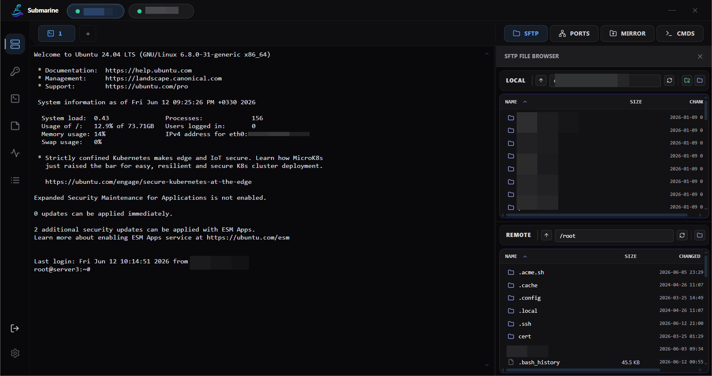
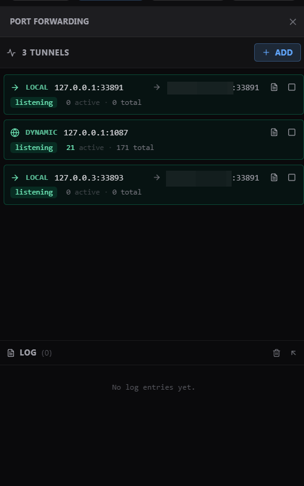
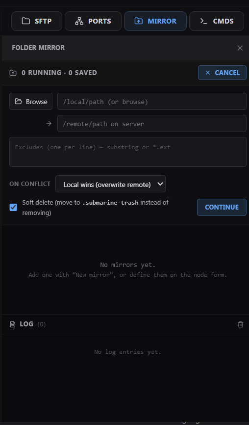
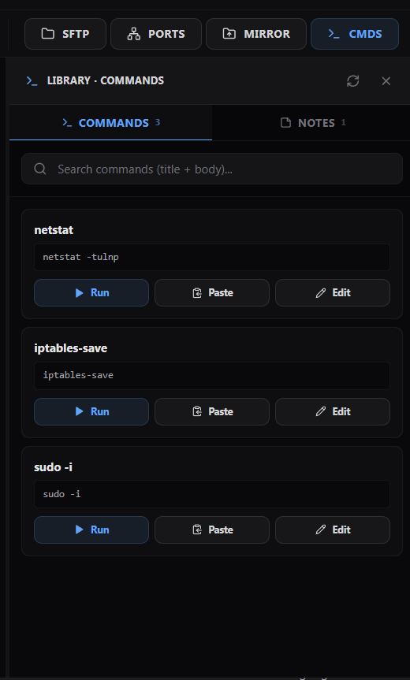
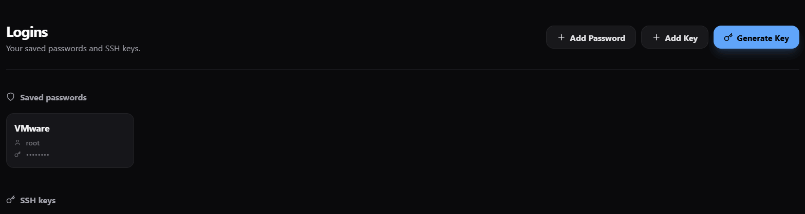
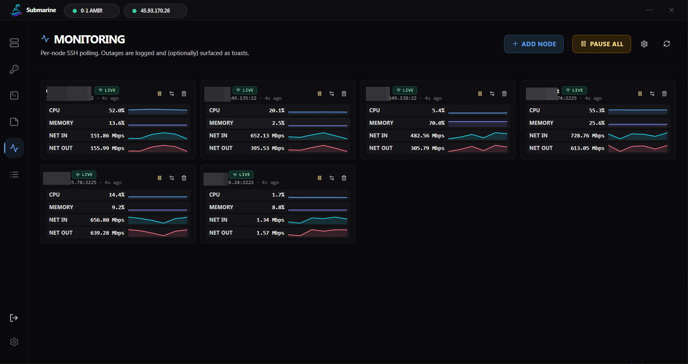
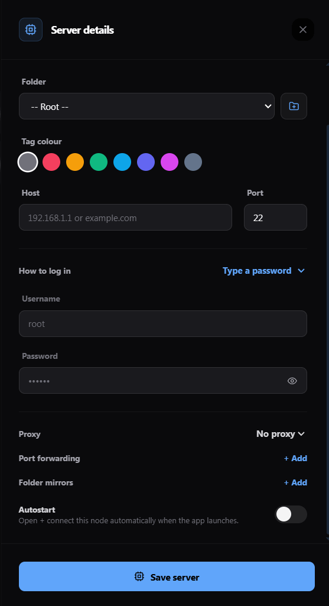

<div align="center">
  
  <h1>Submarine — Modern SSH &amp; SFTP Client</h1>
  <p><strong>A fast, secure SSH and SFTP client for Windows, macOS, Linux — and now Android.</strong></p>
  <p>Manage servers, edit remote files, forward ports, and sync folders from one native window. Built with Rust and Tauri.</p>
  <p>
    <a href="https://github.com/sinaxhpm/submarine/releases"></a>
    <a href="https://github.com/sinaxhpm/submarine/releases"></a>
    <a href="https://github.com/sinaxhpm/submarine/actions"></a>
    
    
  </p>
</div>

---

<div align="center">
  
</div>

> **TL;DR** — Submarine is a fast, free, open-source SSH and SFTP client for Windows, macOS, Linux, and Android. It replaces the typical PuTTY + WinSCP + tunnel-manager stack with one tabbed window per server: terminal, SFTP, port forwarding (SOCKS / HTTP / local / remote), folder mirror, and end-to-end encrypted profile sync. Built with Rust + Tauri. MIT licensed.

## At a glance

- **One window, many tools per server** — terminal, SFTP, tunnels, folder mirror, Docker, live server info, and a per-server command library, all as tabs around the same session
- **Watch many servers at once** — session **split view** to tile any two sessions side-by-side, plus a global **Wall** pinboard for arbitrary terminals across hosts in a grid you control
- **Broadcast input** — type once, send to N selected sessions simultaneously (Tmux `synchronize-panes` for cross-server)
- **Native and cross-platform** — Windows, macOS, Linux (`.deb` / `.rpm` / Arch / AppImage), and Android — same encrypted vault everywhere
- **Zero-knowledge cloud sync** — profiles are Argon2id + AES-256-GCM sealed on your device before upload; the server (and everyone else) only sees ciphertext. Browser dashboard at [`api.sinaxhpm.com/account`](https://api.sinaxhpm.com/account/) to manage your account and stored profiles
- **Docker manager** — containers, logs (live tail), stats, prune, and `docker exec` shells as first-class session tabs
- **Import from anywhere** — PuTTY `.reg`, MobaXterm `.mxtsessions`, OpenSSH config, and Submarine JSON exports all bulk-imported from the Servers page
- **Secure by default** — TOFU host keys with per-connection nonce binding, strict CSP, minimal Tauri permission ACL, zeroized master key

## Screenshots

<table>
  <tr>
    <td width="50%" valign="top" align="center">
      <a href="docs/screenshots/tunnels.png"></a>
      <br/><sub><b>Port forwarding</b> — local / remote / dynamic SOCKS tunnels, live active-connection counters, autostart with the app</sub>
    </td>
    <td width="50%" valign="top" align="center">
      <a href="docs/screenshots/mirror.png"></a>
      <br/><sub><b>Folder mirror</b> — two-way sync, excludes, per-mirror conflict resolution, soft delete to <code>.submarine-trash/</code></sub>
    </td>
  </tr>
  <tr>
    <td width="50%" valign="top" align="center">
      <a href="docs/screenshots/commands.png"></a>
      <br/><sub><b>Quick commands &amp; notes</b> — per-server snippet library and a Notes tab for runbook / contacts</sub>
    </td>
    <td width="50%" valign="top" align="center">
      <a href="docs/screenshots/logins.png"></a>
      <br/><sub><b>Logins</b> — saved passwords and SSH keys, with built-in key generation; all credentials encrypted in the vault</sub>
    </td>
  </tr>
  <tr>
    <td width="50%" valign="top" align="center">
      <a href="docs/screenshots/monitoring.png"></a>
      <br/><sub><b>Monitoring</b> — per-node SSH polling for CPU, RAM, and live network in/out with sparklines</sub>
    </td>
    <td width="50%" valign="top" align="center">
      <a href="docs/screenshots/server-edit.png"></a>
      <br/><sub><b>Server details</b> — folder, tag colour, host, auth, proxy, tunnels, mirrors, and autostart in one form</sub>
    </td>
  </tr>
</table>


## Looking for an alternative to…

If you're searching for one of these, Submarine is a direct fit:

- a free **PuTTY alternative for macOS and Linux** (and a tabbed PuTTY replacement on Windows)
- a **WinSCP alternative** that lives in the same window as your terminal
- a **MobaXterm alternative** that isn't Windows-only and isn't 15-year-old GTK
- a free **Termius alternative** without subscription gating or telemetry
- a modern **Tabby / iTerm2 + SFTP** combo that's actually one app
- a cross-device **Termius-style sync** without a paid plan — your encrypted profiles travel from desktop to your **Android phone** with the same master password
- an **rsync GUI / Syncthing-lite** that mirrors a local folder to a remote SSH host with conflict resolution
- an **Android SSH client** (ConnectBot / JuiceSSH style) that shares saved servers with your desktop

## Why Submarine

Most SSH clients feel like they were built a decade ago and never updated. Submarine is a clean, modern alternative for developers and sysadmins who connect to remote servers every day.

- **Native and fast.** Built with Rust + Tauri — boots in under a second, uses around 80 MB of RAM with several sessions open. No Electron, no battery drain.
- **One window, everything you need.** Terminal, SFTP file browser, port tunnels, folder sync, and saved commands — all live as tabs around each server. No more juggling PuTTY plus WinSCP plus a tunnel app.
- **Secure by default.** Saved servers are encrypted on disk. Optional cloud sync only ever sees encrypted blobs — your passwords and keys can't be read by anyone but you.
- **Truly cross-platform.** Same app on Windows, macOS (Apple Silicon + Intel via Rosetta), and every major Linux distro — `.deb`, `.rpm`, Arch package, and AppImage.

## Key Features

### Terminal

- Tabbed sessions per server and multiple shells per session
- Full xterm.js — true colour, ANSI 256, mouse support
- **Select to copy** — release the mouse over your selection and it's in the clipboard
- Right-click to paste
- Wrapped lines copy as a single line (no phantom blank rows)
- **Reconnect-safe scroll-back** — when a session drops and auto-reconnects, your previous output stays in the buffer to read and copy (a yellow `── reconnected ──` divider marks the boundary)
- **Container shells** — one click from the Docker tab opens a `docker exec` shell into any container, with `bash → sh → ash` auto-fallback so distroless / Alpine / Ubuntu all just work

### SFTP File Browser

- Dual-pane (local on top, remote on bottom) with drag-and-drop between them
- **Tabs or Split layout** — toggle between stacked tabs (one pane visible, more screen real-estate) and the classic split, persisted per device
- **Per-pane filter input** — type to filter the listing live with an N/M counter, Esc to clear
- **Multi-select with Ctrl/Shift-click** plus **Select-All button and Ctrl+A** for bulk download, move, or delete
- **Overwrite confirmation** before clobbering an existing file (both uploads AND downloads — no more silent drag-drop clobber), with "apply to all" for batches
- **Live edit** — double-click any remote file to open it in your default editor; saves auto-upload back to the server
- **Direct download** to the local folder you already have open — no folder picker every time
- Permissions editor with a checkbox grid (chmod / chown)
- Drag files in from your OS file manager to upload

### Folder Mirror

Pick a local folder, pick a remote folder, and Submarine keeps them in sync.

- **Two-way initial sync.** Walks both sides, compares by size and content hash (not just timestamp), and merges them into the same state.
- **Live watcher.** Every save, create, rename, or delete on your local folder pushes to the server in real time.
- **Conflict resolution per mirror.** Pick what wins when a file differs on both sides: **Local wins** (default, like rsync), **Remote wins**, or **Newer wins**.
- **Soft delete.** Removed files move to `.submarine-trash/` on the server — a fat-fingered `rm` won't wipe out remote work.
- **Overwrite-risk advisory.** Before each Start, the dry-run preview calls out which files would be overwritten locally and warns that edits made during the sync window can be silently lost — so you know to save / close editors first.

### Server Info Panel

A read-only inspection pane for the active session — no terminal commands required.

- **Overview** — hostname, OS, kernel, uptime, load average, CPU count, RAM / swap meters, disk usage per mount
- **Network** — NICs (UP-first, with IPv4/IPv6 addresses and MAC), routing table, and **firewall rules** (`iptables` chains rendered per-chain with colored ACCEPT/DROP/REJECT badges; `nftables` raw view)
- **Ports** — listening sockets via `ss -tulnp` (or `netstat` fallback) with PID and process name, protocol + state filters
- **Services** — `systemctl` units with **Start / Stop / Restart** buttons (auto-retries with `sudo -n` on permission denied)
- All tabs **lazy-load on click** so opening Info doesn't fire five probes at once
- Sudo permission errors surface a clear, actionable banner instead of a raw stderr dump

### Docker Manager

Manage Docker on any session host without typing a single `docker` command.

- **Containers** — list, **Start / Stop / Restart / Pause / Kill** inline, click a name for details
- **Logs** with adjustable tail (500 → 50 000) and a **Live stream** toggle that follows new output, smart auto-scroll
- **Stats** (CPU %, mem, net I/O, block I/O), **Inspect** (raw JSON with copy), parsed **Env / Mounts / Ports**
- **Resources** sub-tab for Images, Volumes, and Networks (lazy per-kind)
- **Compose viewer per container** — reads the compose file path from container labels and shows the YAML inline
- **Safe Prune** scopes only (containers / images / networks / builder / system) — never `--volumes`, never `-a` so nothing important gets eaten
- **Container terminal** — open an interactive `docker exec` shell as a new session tab
- Cross-platform (Linux / macOS / Windows hosts) — tries `docker` first, falls back to `sudo -n docker` on permission errors

### Port Forwarding

- Local (`-L`), Remote (`-R`), and Dynamic (`-D`) tunnels
- Dynamic supports **SOCKS4, SOCKS4a, SOCKS5, SOCKS5h, HTTP CONNECT, and plain HTTP proxy**
- Each tunnel starts and stops independently, saved with the server profile

### End-to-End Encrypted Profile Sync

- Save servers once, access them on every machine you own
- The sync server hosts an opaque encrypted blob — we have no way to read it (see [Security](#security))
- No registration. No password recovery email. Your master password never leaves your device.

### Productivity

- **Quick commands**: per-server snippet library, surfaced inside any open session
- **Per-node notes**: a dedicated description / runbook / contacts field on every server, scoped only to that server
- **Autostart**: flag a server and it opens and connects when the app launches
- **Resource monitor**: live CPU, RAM, disk, and network sparklines per host
- **Quick connect**: one-off sessions without saving
- **TOFU host keys**: first-use prompt with fingerprint, pinned afterwards

## Install

Pick a binary from the [latest release](https://github.com/sinaxhpm/submarine/releases) and you're done — no extra dependencies.

| OS | File |
|---|---|
| Windows 10 / 11 | `.exe` installer or `.msi` |
| macOS (Apple Silicon, or Intel via Rosetta) | `.dmg` or `.app.zip` |
| Debian / Ubuntu / Mint | `.deb` — `sudo apt install ./submarine_*.deb` |
| Fedora / RHEL / openSUSE | `.rpm` — `sudo dnf install ./submarine-*.rpm` |
| Arch / Manjaro / EndeavourOS | `.pkg.tar.zst` — `sudo pacman -U submarine-*.pkg.tar.zst` |
| Any Linux | `.AppImage` — `chmod +x` and double-click |
| Android 8.0+ | `.apk` — sideload, no Play Store required |

> Builds are currently **unsigned**. Windows SmartScreen will prompt — click "More info → Run anyway". On macOS you may need `xattr -d com.apple.quarantine /Applications/Submarine.app`. Android sideloading needs "Install unknown apps" enabled for the installer source.

### Android

Submarine on Android is a true native build of the same Rust core — same SSH stack, same encrypted vault, same profile sync. Reach a server from your phone with the same credentials you saved on your desktop.

- **Same encrypted vault.** Cloud sync drops your profiles onto the phone exactly as they were on desktop. Nothing re-typed.
- **Tabbed terminal optimised for touch.** Mobile soft keyboards don't have Ctrl / Alt / Shift / Esc / Tab — Submarine ships an inline **soft-key bar** between xterm and the OS keyboard with Termux-style sticky modifiers (tap to arm, double-tap to lock). Ctrl+letter, Alt+letter, and Shift+Tab all work as expected.
- **Auto-scroll on focus.** Tap the terminal and the prompt scrolls into view; the same fires when the OS keyboard opens so the cursor row never sits hidden behind the keyboard.
- **SFTP file browser** with multi-select, upload from the phone's storage, download into Downloads.
- **Port forwarding (SOCKS / local / remote)** runs as long as the app is open — handy for tunnelling a mobile browser through your home box.
- **Touch-friendly Info / Docker tabs.** Same server inspection and container manager as desktop, with ≥32 px touch targets and full-bleed modals.
- **Folder mirror is desktop-only for now** — Android's filesystem permissions don't map cleanly onto our watcher model.

Tested on Android 8.0+ (API 26+). Phones, tablets, and Android-on-ChromeOS.

## Security

Your data is encrypted on your machine before anything leaves it. Submarine and the sync server never see your passwords, private keys, or profile content.

**How it works:**

1. **Your master password becomes a vault key — on your device.** When you unlock, your password is run through Argon2id to derive a key. The password is wiped from memory the moment derivation finishes. It never goes anywhere.
2. **Profiles are sealed with AES-256-GCM — on your device.** Every saved server (credentials, keys, tunnels, notes, mirrors) is compressed and encrypted with that key. What hits disk is opaque ciphertext.
3. **Sync uploads that same ciphertext — byte for byte.** When you turn cloud sync on, the bytes uploaded are exactly the encrypted blob from your disk. The server stores ciphertext plus a random nonce. Nothing else.

**Why the sync server can't read your profiles:**

- No registration with a server-side password. No recovery email. No "forgot password" flow. **There is nothing on the server that could be used to derive your key.**
- Encryption happens before the upload call. By the time bytes hit the network they are already ciphertext with no key material attached.
- Even with a full server breach, an attacker gets the same opaque blob they'd see if you uploaded a random file to S3. Same threat model.

**Other defences:**

- Master key kept in zeroized memory, wiped on lock
- TOFU host keys with per-connection nonce binding (resists prompt-race attacks)
- Strict Content Security Policy, minimal Tauri permission ACL, no shell or filesystem plugins exposed to the UI

## FAQ

### Is Submarine free?

Yes. MIT-licensed. Use it personally, use it at work, fork it, redistribute it.

### Does it work offline?

Yes. Cloud sync is opt-in. All profiles, mirrors, and tunnels live locally and are encrypted at rest.

### How is it different from PuTTY, WinSCP, or MobaXterm?

PuTTY and WinSCP are two separate apps you alt-tab between. MobaXterm bundles them but feels dated and is Windows-only. Submarine puts terminal, SFTP, tunnels, and folder mirror in one modern tabbed window per server — and runs natively on Windows, macOS, and Linux.

### Does it support keys with passphrases?

Yes. File-based keys and pasted PEM/OpenSSH keys, with or without passphrase.

### Can I sync profiles between Windows and macOS?

Yes. The encrypted vault is platform-portable. Enable sync on one machine, unlock on another with the same master password.

### Why Rust and Tauri instead of Electron?

Smaller installer (around 10 MB vs ~100 MB for an Electron equivalent), lower RAM, faster startup, native window controls, and no Chromium per app.

### Where are my profiles stored?

In a single encrypted file under your OS app-data directory. Nothing in plaintext. Nothing in a global Keychain or registry hive.

### Does Submarine collect telemetry or analytics?

No. There's no analytics SDK, no crash reporter that sends data home, no "phone home" call on launch. The only outbound network call beyond your SSH targets is the optional cloud-sync endpoint at `api.sinaxhpm.com`, and that endpoint only ever receives opaque ciphertext.

### Can I use Submarine on my Android phone with the same servers as my desktop?

Yes. Install the APK, unlock with the same master password you use on desktop, and the encrypted vault syncs. Every server, key, and saved tunnel appears on the phone. Folder mirror is desktop-only for now; everything else (terminal, SFTP, port forwarding) works on Android.

### Is Submarine on the Play Store?

No. Distribution is via sideloadable APK from the [releases page](https://github.com/sinaxhpm/submarine/releases). This keeps the same untouched binary running on every platform with no store-mandated changes.

## Build from Source

Requirements: Node 20+, Rust stable, [Tauri prerequisites](https://v2.tauri.app/start/prerequisites/) for your OS. Windows additionally needs **Strawberry Perl** for the vendored OpenSSL build (`winget install StrawberryPerl.StrawberryPerl`).

```bash
git clone https://github.com/sinaxhpm/submarine
cd submarine
npm install
npm run tauri dev          # run in development
npm run tauri build        # build release bundle
```

### Android build

Extra requirements: Android SDK + Platform-Tools, NDK 27, and JDK 17. `scripts/android-env.ps1` sets `JAVA_HOME`, `ANDROID_HOME`, and `NDK_HOME` for the current PowerShell session.

```powershell
. .\scripts\android-env.ps1
npm run android:init       # one-time per checkout
npm run android:dev        # build + install on the connected device
npm run android:build      # produce a signed-with-debug-key APK
```

Device must be plugged in over USB with debugging enabled.

`npm run android:dev` runs `scripts/android-dev.ps1`, which:

1. Verifies `adb` is on PATH and at least one device is listed.
2. Applies `adb reverse tcp:1420 tcp:1420` and `tcp:1421 tcp:1421` (Vite dev + HMR) so the WebView reaches the host via USB loopback.
3. Runs `tauri android dev --host 127.0.0.1` so the WebView's `devUrl` bakes in `127.0.0.1`, matching what `adb reverse` exposes.

This path works whether Wi-Fi is on or off — only USB matters. If you still see `failed request for http://127.0.0.1:1420` while debugging, USB has dropped or the reverse mapping was cleared (re-plug, reboot, or `adb kill-server` all clear it). Re-run `npm run android:dev` and it'll re-apply the mapping. To bypass the helper, use `npm run android:dev:raw` (calls `tauri android dev` directly — Tauri then picks the host's LAN IP).

## Tech Stack

**Frontend** — React 18 · TypeScript · Tailwind CSS · xterm.js
**Backend** — Rust · Tauri 2 · russh · rusqlite · aes-gcm · argon2 · zstd

## Credits

Designed and built by [Sina](https://sinaxhpm.com) in collaboration with [Claude](https://claude.com/claude-code). Every line of code in this repo was written together with Anthropic's Claude.

## License

MIT — see [LICENSE](LICENSE).

---

<sub>
<b>Keywords</b>: SSH client, SFTP client, terminal emulator, port forwarding, SOCKS proxy, HTTP proxy, folder mirror, folder sync, remote file edit, encrypted profile sync, zero-knowledge cloud, Argon2id, AES-256-GCM, TOFU host keys, Rust, Tauri, React, xterm.js, Windows SSH client, macOS SSH client, Linux SSH client, Android SSH client, open source SSH, MIT licensed, PuTTY alternative, WinSCP alternative, MobaXterm alternative, Bitvise alternative, Termius alternative, SecureCRT alternative, Royal TSX alternative, ConnectBot alternative, JuiceSSH alternative, rsync GUI, sshfs alternative, Tabby alternative.
</sub>

<sub><i>Bitvise, forever in my heart.</i></sub>
